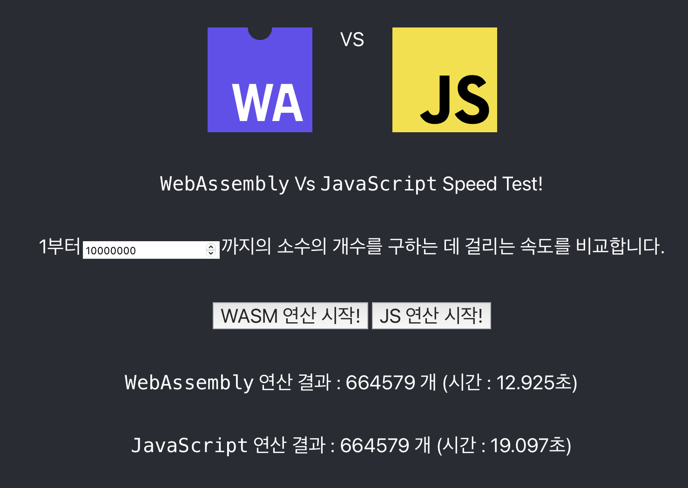

# WebAssembly vs Javascript Speed Test
## 사용법
rust와 node, wasm-pack 라이브러리가 설치되어 있어야 합니다.
```shell
$> wasm-pack build --target web --out-dir webapp/src/lib/wasm
$> cd webapp
$> npm run dev
```
http://localhost:3000 에 접속합니다.

## 실행 결과 예제
